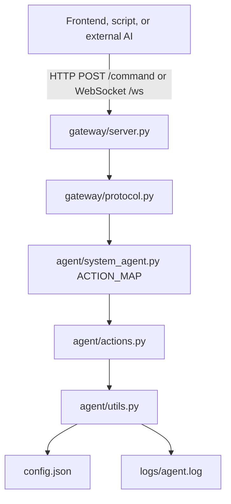

# AI System Agent Technical Audit and Refactor Roadmap

## 1. Executive summary

AI System Agent is a compact local Windows automation gateway. The implemented system is a single-process FastAPI application that validates a shared token, validates JSON command shape, dispatches commands through an in-process registry, and executes local desktop, process, and file operations. The project is small and understandable, but it has drifted from a clean production-ready repository: generated artifacts and logs are tracked, dependency metadata and tests are missing, root-level audit documents contain stale or inaccurate findings, and the README omits several operational and extension details.

The highest-priority work is repository hygiene and safety hardening: add machine-readable dependency metadata, remove tracked runtime artifacts, move real configuration to an example/template model, add tests around command validation and path sandboxing, tighten process launch behavior, and document the actual architecture without overstating security guarantees.

## 2. Documentation audit

### 2.1 README versus implemented code

| Area | README state | Codebase reality | Recommended correction |
| --- | --- | --- | --- |
| Repository root naming | Shows commands from an `ai_agent/` folder and a layout headed by `ai_agent/`. | The repository root is `AI-System-Agent`; packages are `agent/`, `gateway/`, and `frontend/`. | Rename examples to use the repository root and remove the misleading `ai_agent/` wrapper from the tree. |
| Dependencies | Lists `fastapi`, `uvicorn`, `pyautogui`, and `psutil` in prose. | No `requirements.txt`, `pyproject.toml`, lockfile, or Python version constraint exists. | Add dependency metadata and update README to install from it. |
| Runtime configuration | Shows `config.json` as the primary configuration file. | A real tracked `config.json` contains personal Windows paths and the placeholder shared secret. | Track `config.example.json`, gitignore real `config.json`, document environment-variable or local-only secret setup. |
| Security claim: localhost binding | README says the server binds to `127.0.0.1` only. | `gateway/server.py` hardcodes `127.0.0.1` in the `__main__` path, and `run_all.bat` passes `--host 127.0.0.1`. This is accurate for documented launch paths. | Keep the claim, but clarify that users must preserve this host when launching uvicorn manually. |
| Security claim: no default/bypass token | README says an empty secret refuses all commands. | `validate_token()` returns `False` when `shared_secret` is missing or falsey. | Accurate; document that the committed placeholder must be changed before use. |
| Response shape | README says responses are always `{"status":"ok|error","details":...}`. | All helper-generated results use this shape; HTTP errors also use it as JSON content. | Accurate; add future error-code/versioning caveat. |
| WebSocket auth | README says token can be in the JSON body for WebSocket clients. | `/ws` accepts JSON text messages and checks `token` in the body. | Accurate; add an example WebSocket payload. |
| Manual frontend | README describes `frontend/index.html` as a manual test console. | The frontend is exactly a JSON textarea and fetch client. | Accurate; clarify it is not a chat UI or natural-language interface. |
| Action list | README lists ten actions. | `ACTION_MAP` defines the same ten actions. | Accurate today; add an `/actions` endpoint later to avoid future drift. |
| Logs | README says logs are written to `logs/agent.log`. | Logger writes to `logs/agent.log`, but this runtime log is tracked in git. | Document logs as runtime artifacts and remove them from version control. |
| Autostart | README documents Startup-folder shortcut to `run_all.bat`. | `run_all.bat` uses the Windows `py` launcher and a fixed port. | Document that this requires Python Launcher for Windows, or make the script read the configured port. |

### 2.2 Outdated or misleading internal documents

- `REPOSITORY OVERVIEW.md` and `Browser-Based AI Chat Integration.md` include conversational transcript fragments at the top, making them read like generated notes rather than maintained documentation.
- `AI-System-Agent-Audit.md` states some risks too strongly or inaccurately. For example, the current `safe_path()` resolves the requested path before checking containment, which already blocks many simple symlink escapes where the resolved target is outside the allowlist. The remaining concern is platform-specific behavior, race conditions, junction handling, and missing tests—not a confirmed universal bypass.
- The internal docs discuss future chat/NLU architecture as though it is part of the product direction, but the README positions the project as a structured JSON command receiver. The documentation should explicitly choose one of these product models:
  - **Command gateway model:** external AI generates structured JSON; this repo executes it.
  - **Chat automation model:** this repo owns chat sessions and natural-language parsing.

### 2.3 Missing documentation sections

The README should add:

1. **Requirements**: supported OS, Python version, desktop-session requirements for `pyautogui`, Windows-specific assumptions.
2. **Installation from dependency file**: `python -m venv`, `pip install -r requirements.txt` or `pip install -e .`.
3. **Configuration reference**: every key, type, default, security notes, sample file workflow.
4. **API reference**: `/health`, `/command`, `/ws`, auth methods, request/response schema, error status codes.
5. **Action reference**: action names, required/optional params, side effects, destructive flags.
6. **Security model and limits**: localhost-only assumption, shared-secret limitations, broad power of `open_app` and `close_app`, CORS rationale.
7. **Development workflow**: tests, linting, formatting, local run commands.
8. **Architecture overview**: diagram and module responsibility table.
9. **Troubleshooting**: pyautogui display/session issues, Windows launcher issues, token failures, path allowlist failures.
10. **Roadmap**: testing, safety hardening, protocol metadata, optional chat integration.

## 3. Codebase analysis

### 3.1 Implemented architecture

### 3.2 Modules and responsibilities

| Module/file | Current responsibility | Assessment |
| --- | --- | --- |
| `gateway/server.py` | FastAPI app, CORS, `/health`, `/command`, `/ws`, uvicorn entrypoint. | Clear but mixes app construction, config loading, endpoint behavior, and execution orchestration. Blocking work is called from async handlers. |
| `gateway/protocol.py` | Shared-secret validation and manual command-shape validation. | Small and readable, but should become typed models plus protocol metadata as the API grows. |
| `agent/system_agent.py` | Action registry and dispatcher. | Good single source of truth for current size. Tuple values will not scale well once actions need scopes, destructive flags, timeouts, or examples. |
| `agent/actions.py` | Desktop, process, and file actions. | Responsibilities are grouped by domain but all domains share one file. `open_app(shell=True)` and broad process termination are the main risk points. |
| `agent/utils.py` | Config cache, logging setup, sandbox path validation, response helpers. | Too many cross-cutting concerns in one utility module. Global config cache is simple but static and unvalidated. |
| `frontend/index.html` and `frontend/app.js` | Plain browser-based JSON test console. | Useful for manual testing; not a chat UI and not an integration layer. |
| `run_all.bat` | Windows launcher. | Useful but hardcodes host/port and assumes the `py` launcher. |
| `cronos.ps1` | One-off PowerShell client command. | Contains personal local paths and token placeholder; should move to examples with placeholders or be removed. |
| Root audit docs | Prior analysis and future plans. | Valuable content, but stale and noisy; should be consolidated into maintained docs. |

### 3.3 Outdated patterns and risky constructs

- **No dependency manifest**: setup is not reproducible.
- **No automated tests**: command validation, auth, and path sandboxing are unprotected by regression tests.
- **Runtime artifacts are tracked**: `__pycache__` files and `logs/agent.log` should not be versioned.
- **Real local configuration is tracked**: `config.json` should not contain machine-specific paths in the repository.
- **`subprocess.Popen(..., shell=True)`**: broadens `open_app` from application launch to arbitrary shell command execution for anyone with a valid token.
- **Synchronous execution in async endpoints**: long actions can block the FastAPI event loop.
- **No command timeouts or queueing**: overlapping mouse/keyboard commands can interleave, and hung operations can stall the service.
- **No request-size or rate limits**: a buggy client can flood commands or send large payloads.
- **No structured error codes**: callers cannot reliably distinguish validation failures, auth failures, sandbox denials, and execution failures.
- **No action metadata**: there is no machine-readable way to discover required params, destructive actions, or security scope.
- **Logging may expose sensitive params**: full params are logged without redaction.

### 3.4 Duplicated logic and unclear responsibilities

There is little direct duplicated code. The main concern is not duplication but future responsibility creep:

- `utils.py` mixes config, logging, path policy, and response shaping.
- `actions.py` mixes desktop automation, process management, and file management.
- `ACTION_MAP` currently stores only required params; future concerns will either bloat this tuple or spread metadata into separate structures.
- Protocol validation and dispatch both check required params. This is intentional defense-in-depth, but the command contract would be clearer if generated from typed action metadata.

## 4. Architectural drift

The README mostly matches the implemented command-gateway architecture. Drift exists in the surrounding repository documents rather than the code:

- Root docs imply a future browser chat and NLU product, but the current system is a JSON execution gateway.
- Existing audit docs mention security hardening plans that are not implemented.
- The README does not reflect repository hygiene problems: tracked logs, tracked cache files, and personal config.
- The project layout shown in the README differs from the actual repository root naming.
- The documented dependency workflow is prose-only and does not match a modern Python project layout.

## 5. Refactoring recommendations

### 5.1 Stabilization refactor

1. **Create project metadata**
   - Add `pyproject.toml` or `requirements.txt`.
   - Add Python version constraints.
   - Add a console script or documented module entrypoint.

2. **Split cross-cutting utilities**
   - `agent/config.py`: typed config loading and validation.
   - `agent/logging_config.py`: logger setup and redaction helpers.
   - `agent/results.py`: response helpers and error codes.
   - `agent/path_policy.py`: allowlist enforcement and path tests.

3. **Introduce action metadata**
   - Replace tuple-based `ACTION_MAP` values with an `ActionSpec` dataclass or Pydantic model.
   - Include `name`, `handler`, `required_params`, `optional_params`, `destructive`, `category`, `timeout_seconds`, and `description`.
   - Generate validation, docs, and future `/actions` output from this registry.

4. **Split action modules by domain**
   - `agent/actions/input.py`: mouse/keyboard.
   - `agent/actions/processes.py`: open/close/list process behavior.
   - `agent/actions/files.py`: sandboxed file operations.
   - `agent/actions/registry.py`: central action registry.

5. **Make execution safe and serializable**
   - Add a command execution lock for desktop input actions.
   - Run blocking actions in a thread pool from FastAPI endpoints.
   - Add per-action timeouts.
   - Add a maximum request body size.

6. **Harden process operations**
   - Remove `shell=True` from `open_app` where possible.
   - Keep friendly app aliases but parse arbitrary user input conservatively.
   - Make `close_app` safer: exact PID, exact process name, or dry-run/confirm mode for substring matches.

7. **Use typed protocol models**
   - Add Pydantic request/response models.
   - Return stable error codes.
   - Use constant-time token comparison.

8. **Add tests before broad changes**
   - Unit-test config validation, token validation, command validation, registry metadata, and path policy.
   - Mock `pyautogui`, `psutil`, and `subprocess` for action tests.
   - Add FastAPI endpoint tests with `TestClient` or `httpx`.

### 5.2 Parts to reorganize or rewrite

- **Rewrite config handling** into typed, validated configuration with an example file.
- **Rewrite protocol validation** around Pydantic models and action metadata.
- **Reorganize actions** into package modules once the first new action category is added.
- **Replace root-level generated planning documents** with curated docs in `docs/`.
- **Rewrite README** after dependency and config hygiene work, so setup instructions are executable.

## 6. Extension readiness

### 6.1 Current strengths

- Adding one action is easy: implement a function and register it in `ACTION_MAP`.
- The transport layer and execution layer are separated.
- File operations share a single sandbox choke point.
- The frontend is framework-free and simple to modify.

### 6.2 Current limits

- No plugin boundaries or action categories.
- No machine-readable action schema for external AI tools.
- No permission model for new integrations.
- No command queue, locking, or session model.
- No formal API version.
- No internal event bus or audit trail.

### 6.3 Modernization steps

1. Add `GET /actions` generated from action metadata.
2. Version the protocol with either `/v1/command` or a `protocol_version` field.
3. Add scoped tokens before exposing the gateway to more clients.
4. Add a structured audit log with redacted params.
5. Add optional command sessions for WebSocket callers.
6. Preserve the JSON-command model as the stable core; treat chat/NLU as an optional adapter rather than mixing natural-language parsing into the dispatcher.

## 7. Prioritized PR task list

### PR 1 — Repository hygiene and safe configuration

- **Purpose:** Stop tracking runtime artifacts and personal configuration.
- **Affected files:** `.gitignore`, `config.example.json`, `config.json`, `logs/agent.log`, `agent/__pycache__/`, `gateway/__pycache__/`, `cronos.ps1` or `examples/cronos.ps1`.
- **Expected impact:** Prevent accidental secret/log/cache commits and make local setup safer.
- **Risk level:** Medium, because existing users may rely on tracked `config.json`.
- **Testing requirements:** Verify server starts with a locally copied `config.json`; verify docs describe setup.

### PR 2 — Dependency manifest and development workflow

- **Purpose:** Make installation reproducible.
- **Affected files:** `pyproject.toml` or `requirements.txt`, README, optional `Makefile`/scripts.
- **Expected impact:** New contributors can install and run consistently.
- **Risk level:** Low.
- **Testing requirements:** Fresh virtualenv install; import `gateway.server`; run `/health` smoke test.

### PR 3 — Core regression tests

- **Purpose:** Protect auth, validation, dispatch, and sandbox behavior before refactoring.
- **Affected files:** `tests/`, `pytest` config, CI workflow if added.
- **Expected impact:** Enables safe future changes.
- **Risk level:** Low.
- **Testing requirements:** `pytest`; mocked tests for OS-touching actions.

### PR 4 — Typed config and protocol models

- **Purpose:** Replace unvalidated dictionaries with explicit contracts.
- **Affected files:** `agent/config.py`, `gateway/models.py`, `gateway/protocol.py`, `gateway/server.py`, tests.
- **Expected impact:** Better error messages, OpenAPI documentation, fewer malformed requests reaching dispatch.
- **Risk level:** Medium.
- **Testing requirements:** Unit tests for config/schema validation; endpoint tests for valid and invalid payloads.

### PR 5 — Action registry with metadata and `/actions`

- **Purpose:** Make action capabilities discoverable and extensible.
- **Affected files:** `agent/system_agent.py`, `agent/actions.py` or new action package, `gateway/server.py`, README/API docs.
- **Expected impact:** External AI clients can discover actions; registry can support scopes/timeouts/destructive flags.
- **Risk level:** Medium.
- **Testing requirements:** Registry unit tests; snapshot/schema test for `/actions`.

### PR 6 — Execution safety: timeouts, locking, and async offload

- **Purpose:** Prevent hung or overlapping commands from blocking the service or fighting over input devices.
- **Affected files:** `agent/system_agent.py`, `gateway/server.py`, new execution service module, tests.
- **Expected impact:** More reliable gateway under concurrent or faulty clients.
- **Risk level:** High, because it changes execution semantics.
- **Testing requirements:** Timeout tests, concurrent request tests, mocked slow action tests.

### PR 7 — Process action hardening

- **Purpose:** Reduce accidental destructive behavior in app launch/termination.
- **Affected files:** `agent/actions.py` or `agent/actions/processes.py`, tests, README action docs.
- **Expected impact:** Safer `open_app` and `close_app` behavior.
- **Risk level:** Medium.
- **Testing requirements:** Mocked subprocess tests; mocked psutil tests; backwards-compatibility tests for known aliases.

### PR 8 — Audit logging and redaction

- **Purpose:** Record command activity safely for debugging and accountability.
- **Affected files:** `agent/logging_config.py`, gateway middleware or server endpoints, docs, tests.
- **Expected impact:** Better operational visibility without leaking secrets or large text payloads.
- **Risk level:** Medium.
- **Testing requirements:** Audit log format tests; redaction tests.

### PR 9 — README and docs rewrite

- **Purpose:** Align documentation with the stabilized implementation.
- **Affected files:** `README.md`, `docs/architecture.md`, `docs/api.md`, `docs/security.md`, `docs/development.md`, root legacy docs.
- **Expected impact:** Lower onboarding friction and less architectural confusion.
- **Risk level:** Low.
- **Testing requirements:** Link check; command examples verified against tests or smoke server.

### PR 10 — Optional chat adapter exploration

- **Purpose:** Decide and prototype whether chat/NLU belongs in this repo.
- **Affected files:** `frontend/`, optional `gateway/chat.py`, `docs/chat-integration.md`.
- **Expected impact:** Clear path for conversational UX without destabilizing the command gateway.
- **Risk level:** Medium to high depending on scope.
- **Testing requirements:** UI smoke tests; WebSocket tests; parser tests if NLU is implemented.

## 8. Documentation update plan

1. **Freeze the intended product model**
   - Decide whether the project is primarily a JSON command gateway or a full chat automation system.
   - Recommendation: document JSON command gateway as the stable core and treat chat as an optional adapter.

2. **Clean the documentation set**
   - Move durable docs into `docs/`.
   - Archive or replace root-level generated audit files.
   - Keep README focused on installation, usage, safety, and links to deeper docs.

3. **Rewrite README structure**
   - Title and one-paragraph purpose.
   - Warning banner: local desktop automation can control input/processes/files.
   - Feature list.
   - Requirements.
   - Quick start.
   - Configuration.
   - Running the gateway.
   - Manual frontend.
   - API examples.
   - Action reference summary.
   - Security notes.
   - Development/testing.
   - Roadmap and docs links.

4. **Add architecture documentation**
   - Include a Mermaid component diagram.
   - Include a command lifecycle sequence diagram.
   - Include a module responsibility table.
   - Explicitly state the single-process model.

5. **Add API documentation**
   - Document `/health`, `/command`, `/ws`, and future `/actions`.
   - Provide HTTP and WebSocket examples.
   - Document response shape and error status behavior.

6. **Add security documentation**
   - Explain localhost-only assumptions.
   - Explain shared-secret limitations.
   - Explain file sandbox policy.
   - Explain unsandboxed process/input actions.
   - Provide safe deployment checklist.

7. **Add development documentation**
   - Virtualenv setup.
   - Dependency installation.
   - Test commands.
   - How to add an action.
   - How to update action docs.

8. **Add examples**
   - `examples/http_command.py`.
   - `examples/command.ps1` with placeholder paths.
   - WebSocket example.
   - File operation examples using placeholder allowed directories.

## 9. Immediate action checklist

- Add `.gitignore` and stop tracking `__pycache__`, `*.pyc`, and logs.
- Replace tracked `config.json` with `config.example.json` and document local copy setup.
- Add dependency metadata.
- Add tests for `validate_token()`, `validate_command()`, and `safe_path()`.
- Remove or constrain `shell=True` in process launching.
- Add README corrections for repository layout, requirements, API examples, and limitations.
